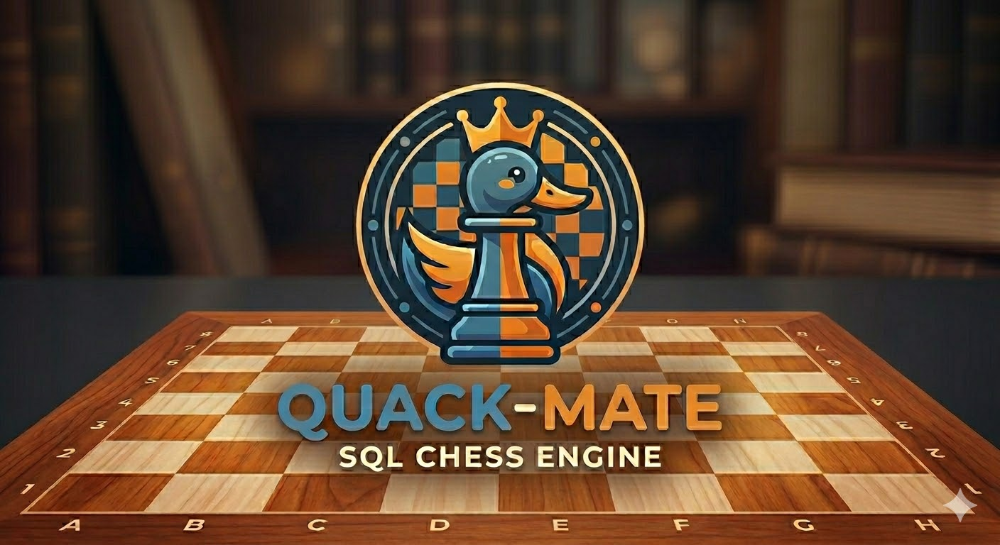

# Quackmate

A Chess Engine written entirely in SQL (DuckDB).

⚡️ **[Play Quack-Mate Online!](https://swingbit.github.io/quack-mate/)**

## Overview

Quackmate is a proof-of-concept chess engine where the core logic — move generation, board state management, and search algorithms — is implemented entirely using SQL queries. The project explores the boundaries of relational databases by hosting a fully-fledged chess engine inside [DuckDB](https://duckdb.org/) operating on both [browser-based WebAssembly](https://duckdb.org/docs/current/clients/wasm/overview) and high-performance native server instances.

* **Live Demo:** Play the WASM version of Quack-Mate online in your browser at **[swingbit.github.io/quack-mate/](https://swingbit.github.io/quack-mate/)**
* **Technical Deep Dive:** Read all about the architectural choices, heuristics, and performance benchmarks in the **[Quack-Mate Blog Post](https://swingbit.github.io/quackmate/)**

---

## Features

- **Database-Centric State**: The chessboard state is stored and modified entirely inside DuckDB tables.
- **SQL Move Generation**: Generates all pseudo-legal and legal moves (except en-passant) using relational joins and bitwise operations on `UBIGINT` bitboards.
- **Dual Search Implementations**:
  - **Batched PVS (Principal Variation Search)**: A highly-optimised search framework with:
    - **Search Strategies**: Principal Variation Search (PVS) with Iterative Deepening and Quiescence Search (QS) (with Stand-pat delta pruning).
    - **Pruning & Reductions**: Alpha-Beta pruning, Reverse Futility Pruning (RFP), Forward Futility Pruning (FFP), Late Move Reduction (LMR), and Late Move Pruning (LMP).
    - **Move Ordering**: MVV-LVA (Most Valuable Victim - Least Valuable Attacker), Piece-Square Tables (PST), Killer Moves, and the History Heuristic.
    - **Transposition Tables**: Seeded Zobrist Hashing for stable position keys, utilising a transposition table for PV-move ordering.
  - **Recursive CTE Search**: An elegant search strategy that expands and evaluates the minimax game tree using a single recursive SQL query. Exhaustive search: no pruning performed.
- **Cross-Platform Adaptability**:
  - **DuckDB WASM**: Runs fully sandboxed in the browser main-thread/web-workers. WASM is currently limited to 4 GB RAM.
  - **DuckDB Native (Server)**: Executes engine queries natively over a REST API. No memory limitations.

---

## Repository Structure

- `src/sql/` — **The Brain**<br/>
  Contains core SQL query builders (`schema.js`, `moves.js`, `eval.js`, `search.js`) that formulate schemas, precomputes, move generation, and evaluation queries.
- `src/quackmate.js` — **Engine Orchestration**<br/>
  Coordinates game loops, search frontiers, and table transactions.
- `src/quackmate-node.js` / `src/quackmate-wasm.js` — **Environment Adapters**<br/>
  Wrapper modules for native Node and browser Wasm bindings.
- `src/quackmate-ui.js` — **Interactive Interface**<br/>
  Front-end chessboard controller and dynamic engine factory.
- `quackmate-server.sh` — **Launcher Script**<br/>
  A parametric command-line tool to initialise static or API servers.

---

## How to Run & Develop

### 1. Installation
Install project dependencies from the root directory:
```bash
npm install
```

### 2. Launching the Server
Boot the server using the launcher:
```bash
# Starts both the static web server (Port 8000) and native DuckDB API (Port 3001)
./quackmate-server.sh node

# Or customise server ports
./quackmate-server.sh node --http-port 9000 --api-http-port 4000

# Or start a client-only static HTTP server (runs only WASM/JS engines)
./quackmate-server.sh static --http-port 8080
```

### 3. Playing in the Browser
Open `http://localhost:8000` (or your custom port) in your browser. Under the **Player** dropdown menus, select your preferred engine:
* **DuckDB WASM**: Runs inside the browser's WebAssembly sandbox.
* **DuckDB Native (Server)**: Executes moves on the local native server over REST.
* **DFS JS Engine**: A pure Javascript depth-first search engine, using the same move generation logic and search algorithm as the SQL engine, but without any pruning.

### 4. Custom Server API Configuration
If you run the developer server on a custom port, update the `REMOTE_ENGINE_URL` in `utils/config.js`:
```javascript
export const CONFIG = {
    DUCKDB_WASM_VERSION: '1.33.1-dev53.0',
    REMOTE_ENGINE_URL: 'http://localhost:4000' // Matches your custom API port
};
```
The browser UI will automatically parse this and direct its REST requests to the targeted native backend.

## Reporting Bugs
Have you seen Quack-Mate play a move that suggests a reasoning bug? <br/>
If so, please click on the <strong>Copy Game History</strong> button and paste the content in a new bug report.

## Assets & Licenses
- The **Project Banner** at the top of this README was generated using Google Gemini.
- The **Project Logo** (visible inside the web application) was cropped directly out of that main project banner.
- These graphic assets are derived from AI generation and are distributed freely under the public domain / CC0.
